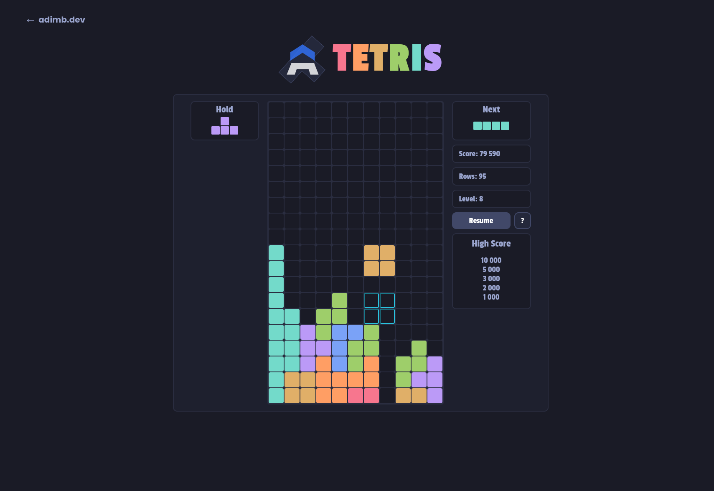

<h1 align="center">
  <br>
  
  <br>
  <a href="https://tetris.adimb.dev">TetrisJS</a>
  <br>
</h1>

<p align="center">
    Ce projet est une reproduction du jeu culte Tetris. <br />
Développer en ReactJS 
</p>




# TODO
[ ] Responsive
## Déployer le site web

```bash
# Clone le dépot
$ git clone https://github.com/AdimBentakouka/tetrisjs.git

$ cd tetrisjs

# Installer les dépendances
$ pnpm install

# Lancer l'application
$ pnpm run dev
```

---

> [adimbentakouka.fr](https://adimbentakouka.fr) &nbsp;&middot;&nbsp;
> GitHub [@adimbentakouka](https://github.com/adimbentakouka) &nbsp;&middot;&nbsp;
> [Linkedin](https://fr.linkedin.com/in/adim-bentakouka)